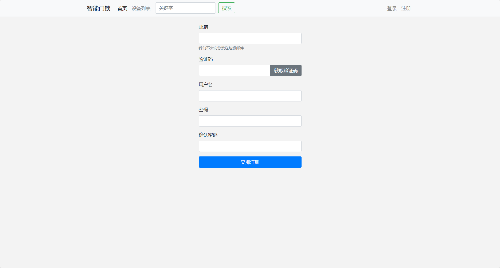
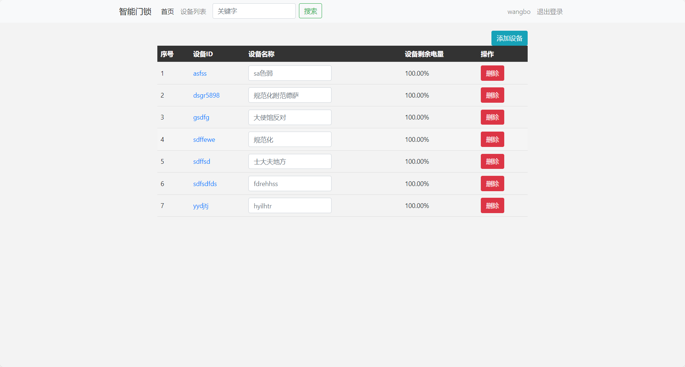
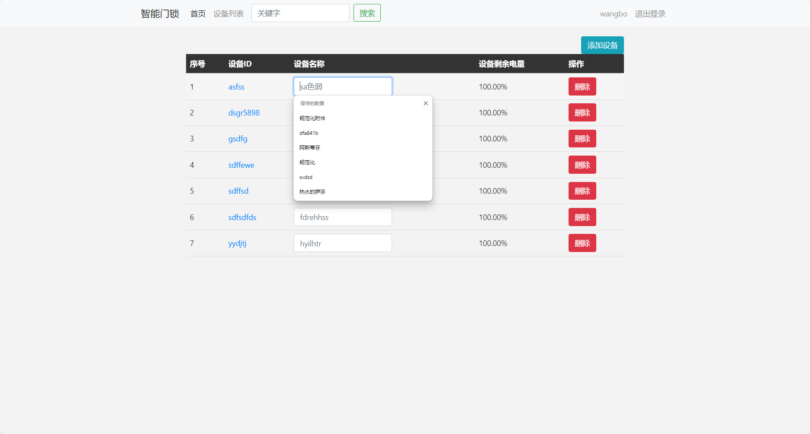
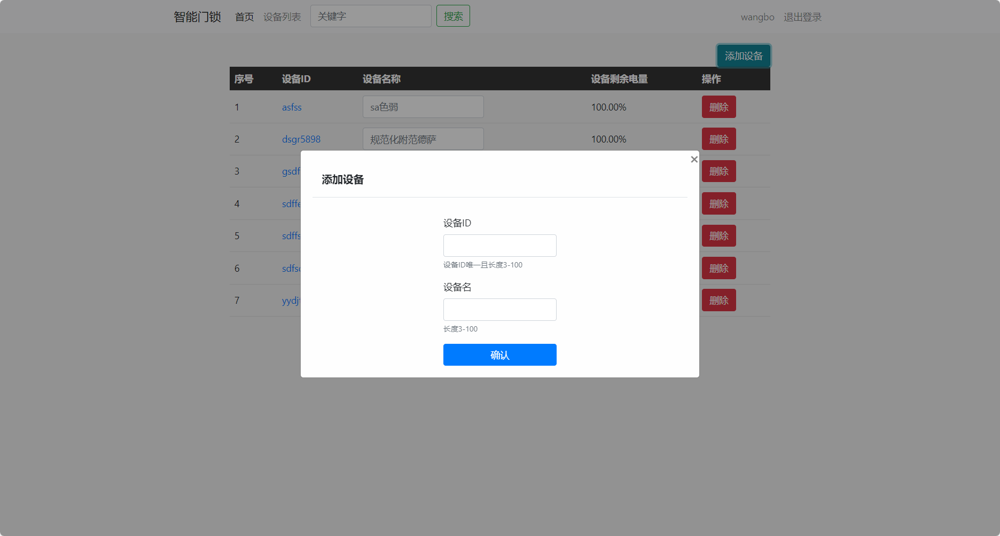
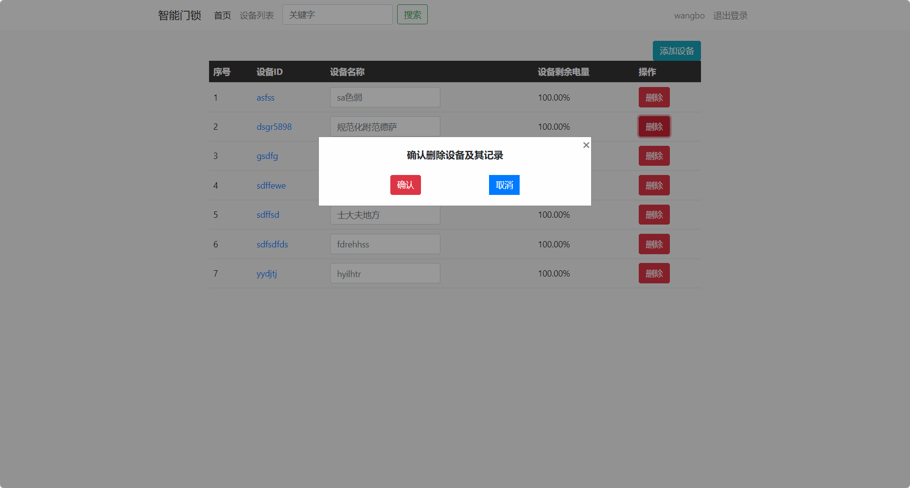
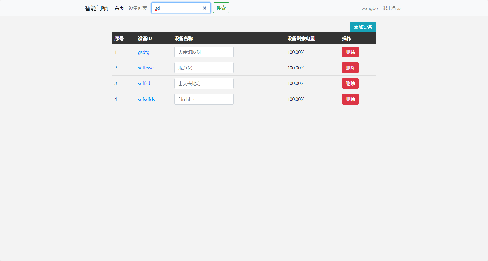
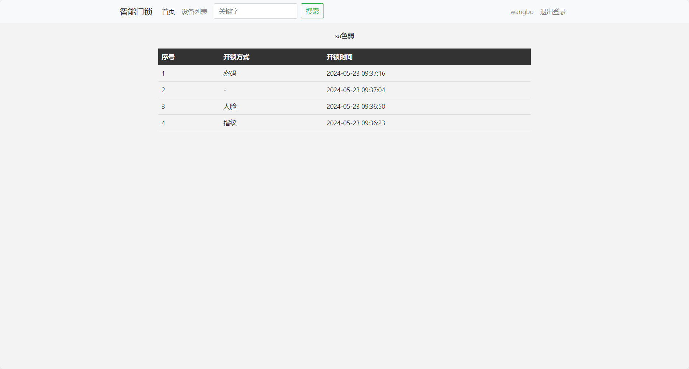
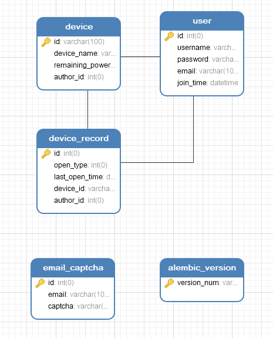

# Intelligent Lock

智能门锁网站

## 项目概述

该项目采用flask框架，结合本地mysql数据库，以网页的形式实现门锁设备增删改查的功能，示例见下图：

新用户使用前需注册账号，点击右上角注册按钮进行注册，验证码会发到所填写的邮箱中

注册后自动跳转至登录页面，输入注册时所填写的邮箱密码即可访问设备列表

在设备名称输入框中修改设备名，回车确认修改

点击添加设备按钮输入不重复的设备ID进行设备添加

点击删除按钮将该设备及其以下记录全部删除

在上方搜索栏输入关键字检索出所有包含该关键字的设备ID

点击设备ID可查询到该设备的所有开锁记录

### 主入口程序

flask的主入口程序在`app.py`中的`app.run(debug=True, port=5000)`，`debug`参数开启调试模式，`port`参数修改服务器端口号

### 数据库设计

数据库相关模型保存在`models.py`文件中，与数据库的表单一一对应

如上图所示，数据库包含五张表单：

- `device`：表中存储所有用户的设备，通过`author_id`关联`user`表
- `user`：表中存储所用已注册的用户
- `device_record`：表中存储所有设备其下的记录，通过`device_id`关联`device`表，通过`author_id`关联`user`表
- `email_captcha`：用于存储注册时产生的临时验证码
- `alembic_version`：用于控制flask和mysql数据库的版本同步

### 接口说明

前端接口存储在`auth.py`、`device.py`文件中

- **登录**

  - **URL**：/auth/login

  - | HTTP请求方式 | 请求参数 | 返回字段 |
    | ------------ | -------- | -------- |
    | GET          | 无       | html     |
    | POST         | 表单     | jsonify  |

- **注册**

  - **URL**：/auth/register

  - | HTTP请求方式 | 请求参数 | 返回字段 |
    | ------------ | -------- | -------- |
    | GET          | 无       | html     |
    | POST         | 表单     | html     |

- **获取验证码**

  - **URL**：/auth/captcha/email

  - | HTTP请求方式 | 请求参数 | 返回字段 |
    | ------------ | -------- | -------- |
    | GET          | 无       | jsonify  |

- **登出**

  - **URL**：/auth/logout

  - | HTTP请求方式 | 请求参数 | 返回字段 |
    | ------------ | -------- | -------- |
    | GET          | 无       | html     |

- **首页**

  - **URL**：/

  - | HTTP请求方式 | 请求参数 | 返回字段 |
    | ------------ | -------- | -------- |
    | GET          | 无       | html     |

- **搜索设备ID**

  - **URL**：/search

  - | HTTP请求方式 | 请求参数 | 返回字段 |
    | ------------ | -------- | -------- |
    | GET          | q        | html     |

  - **示例**：`http://127.0.0.1:8888/search?q=device_id`

- **设备详情**

  - **URL**：/device/device_detail/<device_id>

  - | HTTP请求方式 | 请求参数  | 返回字段 |
    | ------------ | --------- | -------- |
    | GET          | device_id | html     |

  - **示例**：`http://127.0.0.1:8888/device/device_detail/device_id`

- **设备列表**

  - **URL**：/device/devicelist

  - | HTTP请求方式 | 请求参数 | 返回字段 |
    | ------------ | -------- | -------- |
    | GET          | 无       | html     |

- **添加设备**

  - **URL**：/device/addDevice

  - | HTTP请求方式 | 请求参数 | 返回字段 |
    | ------------ | -------- | -------- |
    | GET          | 无       | html     |
    | POST         | 表单     | jsonify  |

- **修改设备**

  - **URL**：/device/modify

  - | HTTP请求方式 | 请求参数 | 返回字段 |
    | ------------ | -------- | -------- |
    | POST         | 表单     | html     |

- **删除设备**

  - **URL**：/device/delete_device

  - | HTTP请求方式 | 请求参数  | 返回字段 |
    | ------------ | --------- | -------- |
    | GET          | device_id | jsonify  |

  - **示例**：`http://127.0.0.1:8888/device/delete_device?device_id=device_id`

### templates

存储前端html文件

### static

存储html相关css样式，javascripts和图片

### migrations

用于数据库版本控制

## 项目配置

1. 下载项目依赖：
   - `pip install -r ./package.txt`
2. 使用`utf8mb4`字符集创建本地数据库
3. 打开`config.py`文件，进行以下配置：
   - `HOSTNAME`：数据库所在域名，本地默认”127.0.0.1“
   - `PORT`：数据库端口号，本地默认3306
   - `DATABASE`：将创建的数据库名替换此处
   - `USERNAME`：数据库管理员名
   - `PASSWORD`：数据库密码
   - `MAIL_SERVER`：邮箱服务器
   - `MAIL_PORT`：邮箱服务器端口
   - `MAIL_USERNAME`：邮箱用户名
   - `MAIL_PASSWORD`：邮箱密码
   - `MAIL_DEFAULT_SENDER`：默认发送邮箱

4. 打开控制台终端输入以下命令：
   - `flask db init`：初始化化数据库，在项目中会生成migrations文件夹
   - `flask db migrate`：提示数据库迁移成功的信息
   - `flask db upgrade`：更新数据库，在数据库中建立对应表单

## 运行

运行`app.py`即可启动项目

